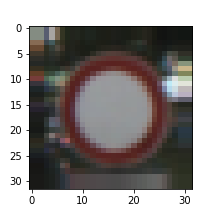

# **Traffic Sign Recognition** 

---

**Build a Traffic Sign Recognition Project**

The goals / steps of this project are the following:
* Load the data set (see below for links to the project data set)
* Explore, summarize and visualize the data set
* Design, train and test a model architecture
* Use the model to make predictions on new images
* Analyze the softmax probabilities of the new images
* Summarize the results with a written report

[//]: # (Image References)

[image1]: ./examples/visualization.jpg "Visualization"
[image2]: ./examples/grayscale.jpg "Grayscaling"
[image3]: ./examples/random_noise.jpg "Random Noise"
[image4]: ./examples/placeholder.png "Traffic Sign 1"
[image5]: ./examples/placeholder.png "Traffic Sign 2"
[image6]: ./examples/placeholder.png "Traffic Sign 3"
[image7]: ./examples/placeholder.png "Traffic Sign 4"
[image8]: ./examples/placeholder.png "Traffic Sign 5"

## Rubric Points

---
Here I will consider the [rubric points](https://review.udacity.com/#!/rubrics/481/view) individually and describe how I addressed each point in my implementation. Here is a link to my [project code](https://github.com/urs-waldmann/CarND-Traffic-Sign-Classifier-Project). 

### Data Set Summary & Exploration

#### 1. Basic summary of the data set

I used the numpy library to calculate summary statistics of the traffic signs data set:
* The size of the training set is 34799.
* The size of the validation set is 4410.
* The size of the test set is 12630.
* The shape of a traffic sign image is (32, 32, 3).
* The number of unique classes/labels in the data set is 43.

#### 2. Exploratory visualization of the dataset

Here is an exploratory visualization of the training data set. It is a bar chart showing how the training data is distributed.

Here we see three traffic sign examples of the training data set.

### Design and Test a Model Architecture

####1. Describe how you preprocessed the image data. What techniques were chosen and why did you choose these techniques? Consider including images showing the output of each preprocessing technique. Pre-processing refers to techniques such as converting to grayscale, normalization, etc. (OPTIONAL: As described in the "Stand Out Suggestions" part of the rubric, if you generated additional data for training, describe why you decided to generate additional data, how you generated the data, and provide example images of the additional data. Then describe the characteristics of the augmented training set like number of images in the set, number of images for each class, etc.)

#### 1. Grayscale

As a first step, I decided to convert the images to grayscale. As it turned out I get a slightly higher accuracy with the colored images. On the one hand the German traffic signs may work even for colour blind people but on the other hand the color is a distinct property of the traffic signs. So I decided to stick with the colored images.

Here are three examples of traffic sign images after grayscaling.

#### 2. Normalization

As a last step, I normalized the image data with the min-max method because in that way the mean of the distribution of the pixel-values is zero and the standard deviation for each pixel-value is the same.
Here are three examples of traffic sign images after grayscaling.

#### 3. Training Data Augmentation

I decided to generate additional training data because some traffic signs are underrepresentated in the original training data set as we saw in the section *Data Set Summary & Exploration* above. This means that the neural network will train and thus optimize its parameters for the overrepresented traffic signs in a better way while it will train and thus optimize its parameters for the underrepresented traffic signs in a worse way. This will have an impact on the accuracy of the test set and the five new German traffic signs. Let us therefore consider the case where within my five new German traffic signs are only traffic signs that in the original training data are underrepresented. In this case my accuracy in predicting the class id of these five new German traffic signs will be low. If I instead consider the case where within my five new German traffic signs are only traffic signs that in the original training data are overrepresented my accuracy in predicting these five new German traffic signs will be high. To balance this I augmented the training data set.
A good way to augment data is to consider methods that already exist in the original data set. In the original training data set the traffic signs are shown from different perspectives, they have different size and their brightness is different. That is why I choose to augment the original training data set using rotation and resize.
To add more data to the the training data set, I resize some of the original training data to a shape of (28, 28, 3) and pad the edges such that my image shape is again (32, 32, 3). Furthermore I rotate some images by -10° and some by 10°.
Another way to augment the training data is to change the brightness of the original training data set. I did not consider this in my implementation.
Here are three traffic sign examples of added images:

We notice that the traffic signs are as recognizable as the traffic signs of the original data.
After the augmenting the original training data the distribution of the traffic signs looks like this:

We note that the distribution of the traffic signs is more even.
Basic summary of the data set after augmentation:
* The size of the training set is now 57028.
* The size of the validation set remains 4410.
* The size of test set remains 12630.
* The shape of a traffic sign image remains (32, 32, 3).
* The number of unique classes/labels in the data set remains 43.

### Model Architecture

####2. Describe what your final model architecture looks like including model type, layers, layer sizes, connectivity, etc.) Consider including a diagram and/or table describing the final model.

My final model consisted of the following layers:

| Layer         		|     Description	        					| 
|:---------------------:|:---------------------------------------------:| 
| Input         		| 32x32x3 RGB image   							| 
| Convolution 3x3     	| 1x1 stride, same padding, outputs 32x32x64 	|
| RELU					|												|
| Max pooling	      	| 2x2 stride,  outputs 16x16x64 				|
| Convolution 3x3	    | etc.      									|
| Fully connected		| etc.        									|
| Softmax				| etc.        									|
|						|												|
|						|												|
 

####3. Describe how you trained your model. The discussion can include the type of optimizer, the batch size, number of epochs and any hyperparameters such as learning rate.

To train the model, I used an ....

####4. Describe the approach taken for finding a solution and getting the validation set accuracy to be at least 0.93. Include in the discussion the results on the training, validation and test sets and where in the code these were calculated. Your approach may have been an iterative process, in which case, outline the steps you took to get to the final solution and why you chose those steps. Perhaps your solution involved an already well known implementation or architecture. In this case, discuss why you think the architecture is suitable for the current problem.

My final model results were:
* training set accuracy of ?
* validation set accuracy of ? 
* test set accuracy of ?

If an iterative approach was chosen:
* What was the first architecture that was tried and why was it chosen?
* What were some problems with the initial architecture?
* How was the architecture adjusted and why was it adjusted? Typical adjustments could include choosing a different model architecture, adding or taking away layers (pooling, dropout, convolution, etc), using an activation function or changing the activation function. One common justification for adjusting an architecture would be due to overfitting or underfitting. A high accuracy on the training set but low accuracy on the validation set indicates over fitting; a low accuracy on both sets indicates under fitting.
* Which parameters were tuned? How were they adjusted and why?
* What are some of the important design choices and why were they chosen? For example, why might a convolution layer work well with this problem? How might a dropout layer help with creating a successful model?

If a well known architecture was chosen:
* What architecture was chosen?
* Why did you believe it would be relevant to the traffic sign application?
* How does the final model's accuracy on the training, validation and test set provide evidence that the model is working well?
 

###Test a Model on New Images

####1. Choose five German traffic signs found on the web and provide them in the report. For each image, discuss what quality or qualities might be difficult to classify.

Here are five German traffic signs that I found on the web:

![alt text][image4] ![alt text][image5] ![alt text][image6] 
![alt text][image7] ![alt text][image8]

The first image might be difficult to classify because ...

####2. Discuss the model's predictions on these new traffic signs and compare the results to predicting on the test set. At a minimum, discuss what the predictions were, the accuracy on these new predictions, and compare the accuracy to the accuracy on the test set (OPTIONAL: Discuss the results in more detail as described in the "Stand Out Suggestions" part of the rubric).

Here are the results of the prediction:

| Image			        |     Prediction	        					| 
|:---------------------:|:---------------------------------------------:| 
| Stop Sign      		| Stop sign   									| 
| U-turn     			| U-turn 										|
| Yield					| Yield											|
| 100 km/h	      		| Bumpy Road					 				|
| Slippery Road			| Slippery Road      							|

The model was able to correctly guess 4 of the 5 traffic signs, which gives an accuracy of 80%. This compares favorably to the accuracy on the test set of ...

####3. Describe how certain the model is when predicting on each of the five new images by looking at the softmax probabilities for each prediction. Provide the top 5 softmax probabilities for each image along with the sign type of each probability. (OPTIONAL: as described in the "Stand Out Suggestions" part of the rubric, visualizations can also be provided such as bar charts)

The code for making predictions on my final model is located in the 11th cell of the Ipython notebook.

For the first image, the model is relatively sure that this is a stop sign (probability of 0.6), and the image does contain a stop sign. The top five soft max probabilities were

| Probability         	|     Prediction	        					| 
|:---------------------:|:---------------------------------------------:| 
| .60         			| Stop sign   									| 
| .20     				| U-turn 										|
| .05					| Yield											|
| .04	      			| Bumpy Road					 				|
| .01				    | Slippery Road      							|

For the second image ... 

