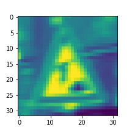

# **Traffic Sign Recognition** 
---

**Build a Traffic Sign Recognition Project**

The goals / steps of this project are the following:
* Load the data set (see below for links to the project data set)
* Explore, summarize and visualize the data set
* Design, train and test a model architecture
* Use the model to make predictions on new images
* Analyze the softmax probabilities of the new images
* Summarize the results with a written report

## Rubric Points
---

Here I will consider the [rubric points](https://review.udacity.com/#!/rubrics/481/view) individually and describe how I addressed each point in my implementation. Here is a link to my [project code](https://github.com/urs-waldmann/CarND-Traffic-Sign-Classifier-Project). 

### Data Set Summary & Exploration

#### 1. Basic summary of the data set

I used the numpy library to calculate summary statistics of the traffic signs data set:
* The size of the training set is 34799.
* The size of the validation set is 4410.
* The size of the test set is 12630.
* The shape of a traffic sign image is (32, 32, 3).
* The number of unique classes/labels in the data set is 43.

#### 2. Exploratory visualization of the dataset

Here is an exploratory visualization of the training data set. It is a bar chart showing how the training data is distributed.

Here we see three traffic sign examples of the training data set.

### Design and Test a Model Architecture

#### 1. Grayscale

As a first step, I decided to convert the images to grayscale. As it turned out I get a slightly higher accuracy with the coloured images. On the one hand the German traffic signs may work even for colour blind people but on the other hand the color is a distinct property of the traffic signs. So I decided to stick with the coloured images.

Here are three examples of traffic sign images after grayscaling.

#### 2. Normalization

As a last step, I normalized the image data with the min-max method because in that way the mean of the distribution of the pixel-values is zero and the standard deviation for each pixel-value is the same.

Here are three examples of traffic sign images after normalization.

#### 3. Training Data Augmentation

I decided to generate additional training data because some traffic signs are underrepresentated in the original training data set as we saw in the section *Data Set Summary & Exploration* above. This means that the neural network will train and thus optimize its parameters for the overrepresented traffic signs in a better way while it will train and thus optimize its parameters for the underrepresented traffic signs in a worse way. This will have an impact on the accuracy of the test set and the five new German traffic signs. Let us therefore consider the case where within my five new German traffic signs are only traffic signs that in the original training data are underrepresented. In this case my accuracy in predicting the class id of these five new German traffic signs will be low. If I instead consider the case where within my five new German traffic signs are only traffic signs that in the original training data are overrepresented my accuracy in predicting these five new German traffic signs will be high. To balance this I augmented the training data set.

A good way to augment data is to consider methods that already exist in the original data set. In the original training data set the traffic signs are shown from different perspectives, they have different size and their brightness is different. That is why I choose to augment the original training data set using rotation and resize.

To add more data to the the training data set, I resize some of the original training data to a shape of (28, 28, 3) and pad the edges such that my image shape is again (32, 32, 3). Furthermore I rotate some images by -10° and some by 10°.

Another way to augment the training data is to change the brightness of the original training data set. I did not consider this in my implementation.

Here are three traffic sign examples of added images:

We notice that the traffic signs are as recognizable as the traffic signs of the original data.

After augmenting the original training data the distribution of the traffic signs looks like this:

We note that the distribution of the traffic signs is more even.

Basic summary of the data set after augmentation:
* The size of the training set is now 57028.
* The size of the validation set remains 4410.
* The size of test set remains 12630.
* The shape of a traffic sign image remains (32, 32, 3).
* The number of unique classes/labels in the data set remains 43.

### Model Architecture

#### 1. Final Model Architecture

My final model consists of the following layers:

| Layer         		|     Description	        					| 
|:---------------------:|:---------------------------------------------:| 
| Input         		| 32x32x3 normalized image   					| 
| Convolution 5x5     	| 1x1 stride, valid padding, outputs 28x28x6 	|
| RELU					|												|
| Max pooling	      	| 2x2 stride,  valid padding, outputs 14x14x6   |
| Convolution 1x1     	| 1x1 stride, valid padding, outputs 14x14x11 	|
| RELU					|												|
| Convolution 5x5	    | 1x1 stride, valid padding, outputs 10x10x16   |
| RELU					|												|
| Max pooling	      	| 2x2 stride,  valid padding, outputs 5x5x6     |
| Fully connected		| inputs 400, outputs 120      					|
| RELU					|												|
| Dropout				| keep 50% of values 							|
| Fully connected		| inputs 120, outputs 84      					|
| RELU					|												|
| Output        		| inputs 84, outputs 43      					|

#### 3. Train the Model

To train the model, I used the Adam optimizer. I have 10 epochs, a batch size of 64 and my learning rate is 0.001. Furthermore are the weights and biases variables initialized with a mean of zero and a standard deviation of 0.05.

#### 4. Discussion (Describe the approach taken for finding a solution and getting the validation set accuracy to be at least 0.93. Include in the discussion the results on the training, validation and test sets and where in the code these were calculated. Your approach may have been an iterative process, in which case, outline the steps you took to get to the final solution and why you chose those steps. Perhaps your solution involved an already well known implementation or architecture. In this case, discuss why you think the architecture is suitable for the current problem.)

My final model results are:
* Validation set accuracy of 94.3%.
* Test set accuracy of 92.9%.

I took an iterative approach to find the best solution for the model architecture:
* I chose the [LeNet](http://yann.lecun.com/exdb/lenet/) architecture because it is a well known architecture of a Convolutional Neural Network.
* There were regularization problems, i.e. overfitting.
* I adjusted the LeNet architecure by adding an additional 1x1 convolution between the two convolutional layers to make my network deeper. Furthermore I added dropout between the two fully connected layers due to overfitting.
* I tuned the amount of values to keep in dropout due to overfitting. I also tuned the filter size of the convolutions. The filter size souldn't be too big because this reduces the size of the model and thus leads to a reduction in accuracy. I furthermore tuned the filter depth in order to make the network deeper. It is more efficient to make the nework deeper than making it wider beause in deeper layers the network already recognizes more complicated structures.
* The advantages of Convolutional Neural Networks is that they are designed to recognize visual patterns directly from pixel images with minimal preprocessing. They can recognize patterns with extreme variability and with robustness to distortions and simple geometric transformations (rotation, resize). An additional 1x1 convolution helps to make the network deeper without changing the structure. Dropout prevents overfitting by setting half of the activations to zero. Thus the model has to learn in a way where it can never rely on any given activation to be present.

Discussing the LeNet architecture:
* I chose the [LeNet](http://yann.lecun.com/exdb/lenet/) architecture.
* It is a well known Convolutional Neural Network architecture for supervised classification problems.
* With the modified LeNet architecture I do not have regularization problems anymore. In addition I obtain a high validation and test accuracy of 94.3% and 92.9% respectively.
 
### Test the Model on New Images

#### 1. Choose five new German traffic signs

Here are five German traffic signs that I found on the web:

![alt text][image4] ![alt text][image5] ![alt text][image6] 
![alt text][image7] ![alt text][image8]

The first image might be difficult to classify because ...

####2. Discuss the model's predictions on these new traffic signs and compare the results to predicting on the test set. At a minimum, discuss what the predictions were, the accuracy on these new predictions, and compare the accuracy to the accuracy on the test set (OPTIONAL: Discuss the results in more detail as described in the "Stand Out Suggestions" part of the rubric).

Here are the results of the prediction:

| Image			        |     Prediction	        					| 
|:---------------------:|:---------------------------------------------:| 
| Stop Sign      		| Stop sign   									| 
| U-turn     			| U-turn 										|
| Yield					| Yield											|
| 100 km/h	      		| Bumpy Road					 				|
| Slippery Road			| Slippery Road      							|

The model was able to correctly guess 4 of the 5 traffic signs, which gives an accuracy of 80%. This compares favorably to the accuracy on the test set of ...

####3. Describe how certain the model is when predicting on each of the five new images by looking at the softmax probabilities for each prediction. Provide the top 5 softmax probabilities for each image along with the sign type of each probability. (OPTIONAL: as described in the "Stand Out Suggestions" part of the rubric, visualizations can also be provided such as bar charts)

The code for making predictions on my final model is located in the 11th cell of the Ipython notebook.

For the first image, the model is relatively sure that this is a stop sign (probability of 0.6), and the image does contain a stop sign. The top five soft max probabilities were

| Probability         	|     Prediction	        					| 
|:---------------------:|:---------------------------------------------:| 
| .60         			| Stop sign   									| 
| .20     				| U-turn 										|
| .05					| Yield											|
| .04	      			| Bumpy Road					 				|
| .01				    | Slippery Road      							|

For the second image ... 

